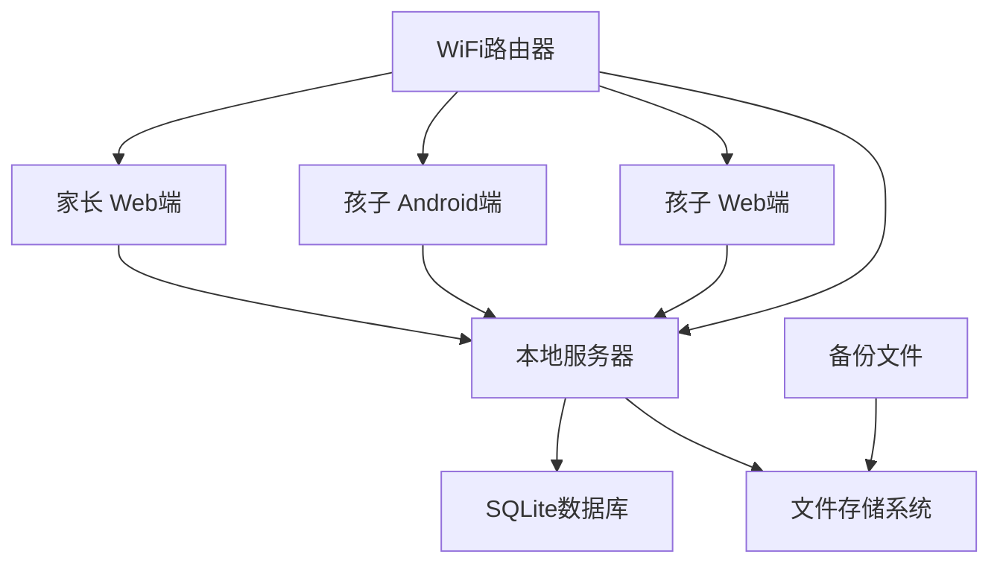

# StarshipPlan 技术设计文档

## 概述

StarshipPlan（星舰计划）是一个专为家庭内部使用的小学生习惯管理系统，采用太空冒险主题的游戏化设计。该系统包含网页端和Android移动端，通过本地部署的方式，让9岁男孩"葫芦"在游戏中培养良好习惯。

技术栈采用简单易维护的家庭友好型方案，确保家长无需专业技术背景即可部署和维护。

## 技术标准对齐

### 家庭项目简化原则
- 采用成熟稳定的技术栈，降低学习和维护成本
- 优先使用现成解决方案，避免过度工程化
- 界面设计注重用户体验，降低使用门槛

### 项目结构规划
- 前后端分离，便于独立开发和维护
- 模块化设计，功能解耦
- 数据模型简单清晰，易于理解和扩展

## 代码复用分析

### 可复用的开源组件
- **SQLite数据库**: 轻量级本地数据库，无需额外配置
- **React/Vue前端框架**: 成熟的前端生态，丰富的UI组件库
- **Flask/Express后端框架**: 简单易学的Web框架
- **Cordova/Capacitor**: 移动端打包方案，一套代码多平台运行

### 集成方案
- **WebRTC**: 家庭网络内实时数据同步
- **Local Storage/IndexedDB**: 前端离线数据缓存
- **File System API**: 本地文件备份导出

## 架构设计

### 系统架构图



### 模块化设计原则
- **单一文件职责**: 每个文件专注一个功能领域
- **组件隔离**: 小而专的组件，避免大而全的文件
- **服务层分离**: 数据访问、业务逻辑、界面展示分离
- **工具模块化**: 工具函数按功能分组

## 组件与接口设计

### 前端组件（React/Vue）

#### 用户管理组件
- **Purpose**: 处理用户登录、注册、档案管理
- **Interface**: LoginForm, UserProfile, UserSettings
- **Dependencies**: AuthService, UserService
- **Features**: 支持家长和儿童两种角色模式

#### 任务管理组件
- **Purpose**: 显示、创建、更新、删除习惯任务
- **Interface**: TaskList, TaskCard, TaskForm, TaskCalendar
- **Dependencies**: TaskService, ReminderService
- **Features**: 太空星球主题的任务展示

#### 游戏化界面组件
- **Purpose**: 提供太空冒险主题的交互体验
- **Interface**: SpaceStation, PlanetExplorer, AvatarCustomize
- **Dependencies**: GameService, AnimationService
- **Features**: 宇航员角色、星球探索、装备收集

#### 积分系统组件
- **Purpose**: 显示星币余额、等级、兑换功能
- **Interface**: StarcoinDisplay, LevelProgress, ExchangePanel
- **Dependencies**: PointsService, AchievementService
- **Features**: 实时动画效果、等级提升动画

### 后端服务（Python Flask/Node.js Express）

#### 用户认证服务
- **Purpose**: 处理用户认证和权限管理
- **Interface**: /api/auth/login, /api/auth/register, /api/auth/verify
- **Dependencies**: Database, JWT（可选简化版）
- **Security**: 家长密码本地哈希存储

#### 数据同步服务
- **Purpose**: 处理多设备间数据同步
- **Interface**: WebSocket连接, REST API
- **Dependencies**: WebSocket库, 冲突解决算法
- **Features**: 实时同步、离线缓存、冲突处理

#### 任务管理服务
- **Purpose**: 管理习惯任务的CRUD操作
- **Interface**: /api/tasks/, /api/tasks/:id, /api/tasks/stats
- **Dependencies**: 数据库ORM, 定时任务调度器
- **Features**: 自动结算、提醒通知

## 数据模型设计

### 用户模型 (User)
```javascript
{
  id: string,           // 唯一标识符
  username: string,     // 用户名
  role: string,         // 角色: 'parent' | 'child'
  avatar: string,       // 头像路径
  level: number,        // 当前等级
  starcoins: number,    // 星币余额
  totalStarcoins: number, // 累计星币
  createdAt: Date,      // 创建时间
  lastLogin: Date       // 最后登录
}
```

### 任务模型 (Task)
```javascript
{
  id: string,           // 任务ID
  userId: string,       // 关联用户
  title: string,        // 任务标题
  description: string,  // 任务描述
  type: string,         // 类型: 'daily' | 'weekly'
  reward: number,       // 星币奖励
  planetTheme: string,  // 星球主题
  difficulty: number,   // 难度等级
  isActive: boolean,    // 是否激活
  createdAt: Date,      // 创建时间
  createdBy: string     // 创建者ID
}
```

### 任务记录模型 (TaskRecord)
```javascript
{
  id: string,           // 记录ID
  taskId: string,       // 任务ID
  userId: string,       // 用户ID
  completedAt: Date,    // 完成时间
  reward: number,       // 获得星币
  quality: number,      // 完成质量评分
  verified: boolean,    // 家长确认状态
  verifiedBy: string,   // 确认家长ID
  notes: string         // 备注
}
```

### 等级记录模型 (LevelRecord)
```javascript
{
  id: string,           // 记录ID
  userId: string,       // 用户ID
  level: number,        // 等级
  unlockedAt: Date,     // 解锁时间
  rewards: string[],    // 解锁奖励
  celebrationBonus: number // 庆祝奖励
}
```

### 惩罚记录模型 (PunishmentRecord)
```javascript
{
  id: string,           // 记录ID
  userId: string,       // 用户ID
  type: string,         // 惩罚类型
  reason: string,       // 惩罚原因
  penalty: number,      // 扣除星币
  duration: number,     // 持续天数
  status: string,       // 状态: 'active' | 'expired' | 'pardoned'
  createdAt: Date,      // 创建时间
  resolvedAt: Date      // 解决时间
}
```

## 错误处理策略

### 网络连接问题
1. **离线模式**: 前端缓存数据，网络恢复后自动同步
2. **同步冲突**: 采用"最后操作优先"策略，用户可选择保留哪个版本
3. **用户影响**: 显示离线状态标识，保证基本功能可用

### 数据库问题
1. **数据库锁定**: 等待机制，避免并发操作冲突
2. **数据损坏**: 自动备份恢复，定期数据完整性检查
3. **用户影响**: 友好错误提示，自动重试机制

### 前端错误
1. **组件渲染错误**: 错误边界捕获，降级显示
2. **动画性能问题**: 检测设备性能，自动降级简化动画
3. **用户影响**: 提供简化版界面，确保核心功能可用

## 测试策略

### 单元测试
- **后端API测试**: 测试所有API端点的输入输出
- **前端组件测试**: 测试组件的渲染和交互
- **数据模型测试**: 验证数据模型的完整性和约束
- **工具函数测试**: 测试业务逻辑和工具函数

### 集成测试
- **数据同步测试**: 验证多设备间的数据同步
- **权限控制测试**: 验证家长和儿童角色的权限隔离
- **离线功能测试**: 测试离线模式下的功能完整性

### 端到端测试
- **用户流程测试**: 从注册到任务完成的完整流程
- **家长控制测试**: 家长管理功能的完整测试
- **多平台测试**: 网页端和移动端的兼容性测试

## 部署与维护

### 本地部署方案
1. **一键安装脚本**: 自动安装依赖、配置数据库
2. **Docker容器化**: 提供Docker版本，简化部署流程
3. **服务自启动**: 配置系统服务，开机自动运行

### 数据备份策略
1. **自动备份**: 每日自动备份到指定目录
2. **手动备份**: 一键导出数据文件
3. **版本管理**: 保留最近7天的备份版本

### 更新维护
1. **在线更新**: 自动检查并下载更新
2. **数据迁移**: 平滑的数据格式升级
3. **回滚机制**: 更新失败时自动回滚

## 性能优化

### 前端优化
- **代码分割**: 按需加载，减少初始包大小
- **图片优化**: 压缩图片资源，使用WebP格式
- **缓存策略**: 合理使用浏览器缓存

### 后端优化
- **数据库索引**: 为常用查询字段建立索引
- **查询优化**: 避免N+1查询，使用连接查询
- **连接池**: 复用数据库连接，提高响应速度

### 网络优化
- **压缩传输**: 启用gzip压缩
- **CDN加速**: 静态资源使用CDN（可选）
- **HTTP/2**: 支持HTTP/2多路复用