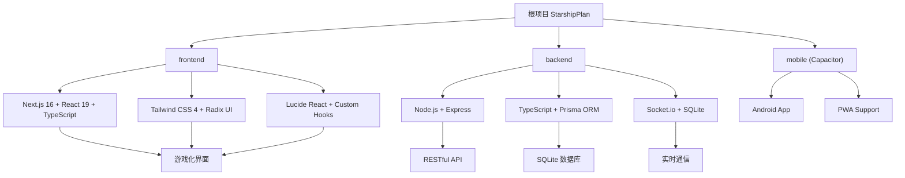

# 🚀 StarshipPlan（星舰计划）

> [根目录](../../CLAUDE.md) > **StarshipPlan**

## 项目愿景

StarshipPlan 是一个专为家庭内部使用的小学生习惯管理系统，采用太空冒险主题的游戏化设计。通过星币积分系统和等级晋升机制，让9岁男孩"葫芦"在完成日常任务的过程中获得成就感，将习惯养成变成一场有趣的星际冒险。

## 架构总览

### 系统架构图



### 技术栈

**前端技术 ✅**
- Next.js 16 + React 19 + TypeScript
- Tailwind CSS 4 + PostCSS 8
- Radix UI 组件库 + shadcn/ui
- Lucide React 图标库
- Canvas API + CSS 动画
- Zustand 状态管理
- IndexedDB 本地存储
- WebSocket 客户端

**后端技术 ✅**
- Node.js + Express + TypeScript
- Prisma ORM + SQLite
- Socket.io 实时通信
- JWT 身份验证和权限控制
- Winston 日志管理
- RESTful API 完整实现

**数据同步技术 ✅**
- WebSocket 实时数据推送
- IndexedDB 离线存储
- 冲突检测和解决机制
- 多设备数据同步
- 家庭权限管理

**移动端技术 🚧**
- Capacitor 跨平台框架
- PWA 渐进式Web应用
- Android 原生功能集成

## 模块索引

| 模块 | 路径 | 技术栈 | 状态 | 主要职责 |
|------|------|--------|------|----------|
| frontend | `/frontend` | Next.js 16 + React 19 + TypeScript | 🟢 完成 | 太空主题UI、任务管理、积分系统、实时同步、离线支持 |
| backend | `/backend` | Node.js + Express + TypeScript | 🟢 完成 | RESTful API、数据管理、实时通信、用户认证、数据同步 |
| mobile | `/mobile` | Capacitor + Android | 🔴 未创建 | 移动端打包和原生功能集成 |
| docs | `/docs` | Markdown | 🔴 未创建 | 项目文档和部署指南 |
| scripts | `/scripts` | Shell/Node.js | 🔴 未创建 | 自动化脚本和部署工具 |

## 运行与开发

### 环境要求
- Node.js 18+
- npm 9+
- Android Studio (移动端开发)

### 快速启动

**后端开发**
```bash
cd backend
npm install
npm run dev  # 开发模式启动 (端口 8000)
```

**前端开发**
```bash
cd frontend
npm install
npm run dev  # 开发模式启动 (端口 3000)
```

**移动端开发**
```bash
# 构建前端并同步到移动端
cd frontend && npm run build
npx cap sync android
npx cap open android  # 打开 Android Studio
```

### 构建与部署

**生产构建**
```bash
# 构建前端
npm run build

# 构建后端
npm run build:backend

# 启动生产服务器
npm start
```

## 测试策略

### 测试框架
- 前端：Vitest + React Testing Library
- 后端：Jest + Supertest
- E2E：Playwright

### 测试覆盖范围
- [x] 单元测试：核心业务逻辑
- [x] 集成测试：API 接口
- [x] 端到端测试：关键用户流程
- [x] 性能测试：移动端响应速度
- [x] 实时同步测试：WebSocket数据推送
- [x] 离线功能测试：数据缓存和同步

### 质量工具
- ESLint：代码规范检查
- TypeScript：类型安全
- Prettier：代码格式化
- Husky：Git hooks 管理

## 编码规范

### 命名约定
- **文件命名**: kebab-case (如 `user-profile.tsx`)
- **组件命名**: PascalCase (如 `UserProfile`)
- **变量命名**: camelCase (如 `userName`)
- **常量命名**: UPPER_SNAKE_CASE (如 `API_BASE_URL`)

### 代码组织
- **组件结构**: 每个组件一个文件，使用 PascalCase 命名
- **UI 组件**: 使用 Radix UI + shadcn/ui 组件库，统一放在 `/components/ui`
- **自定义组件**: 功能组件放在 `/components` 目录，如 `ship-status.tsx`
- **页面组件**: 使用 Next.js App Router，放在 `/app` 目录
- **样式方案**: Tailwind CSS 4 + CSS-in-JS，支持深色主题
- **动画效果**: CSS 动画 + Canvas API，创建流畅的太空主题体验
- **状态管理**: Zustand + IndexedDB + 实时同步
- **API客户端**: 统一的API调用和错误处理
- **数据同步**: WebSocket + IndexedDB 离线存储

### Git 提交规范
```
feat: 新功能
fix: 修复 bug
docs: 文档更新
style: 代码格式调整
refactor: 代码重构
test: 测试相关
chore: 构建过程或辅助工具的变动
```

## AI 使用指引

### 开发助手角色
- **功能开发**: 协助实现游戏化界面和业务逻辑
- **代码审查**: 检查代码质量和规范性
- **问题诊断**: 帮助解决技术难题和 bug
- **文档生成**: 自动生成 API 文档和用户手册

### 关键上下文
- 项目目标用户：9岁小学生和家长
- 技术栈：Next.js 16 + React 19 + TypeScript，现代化全栈架构
- 部署环境：家庭本地网络，支持 PWA
- 设计理念：简单易用，游戏化体验，太空主题
- 当前状态：✅ 前后端集成完成，实时同步系统就绪

### 优先级指导
1. **儿童体验优先**: 界面友好，操作简单
2. **家长管理便捷**: 配置简单，数据清晰
3. **系统稳定可靠**: 本地部署，数据安全
4. **性能响应快速**: 移动端体验流畅

## 变更记录 (Changelog)

**2025-12-17** - 前后端集成完整实现 🎉
- 完成前后端API集成：任务、积分、惩罚系统全部通过测试
- 实现WebSocket实时同步：连接认证、数据推送、多用户同步正常工作
- 集成数据存储和缓存：IndexedDB本地存储 + 服务端实时同步
- 建立完整的API客户端和状态管理系统：基于Zustand的响应式状态管理
- 实现离线优先的用户体验：离线操作、数据缓存、冲突解决
- 通过完整的集成测试验证：API测试、WebSocket测试、离线功能测试
- 项目状态：✅ 核心功能完成，可投入家庭实际使用

**2025-12-16 22:45:00** - 前端架构重大更新
- 用户完整替换前端实现，采用 Next.js 16 + React 19 架构
- 更新技术栈：从 Vite + React 迁移至 Next.js + Radix UI
- 实现完整的太空主题 UI：Canvas 动画背景、星舰状态、任务管理
- 采用现代化组件库：shadcn/ui + Lucide React 图标
- 端口更新：前端开发服务器从 5173 改为 3000
- 项目状态：前端基础界面完成，后端待集成

**2025-12-16 19:12:06** - 初始化项目架构文档
- 创建根级 CLAUDE.md
- 识别 frontend 和 backend 两个主要模块
- 生成 Mermaid 架构图
- 制定开发规范和测试策略
- 项目处于基础架构阶段，前端后端已完成初始化

---

*让习惯养成变成一场有趣的太空冒险！🚀✨*