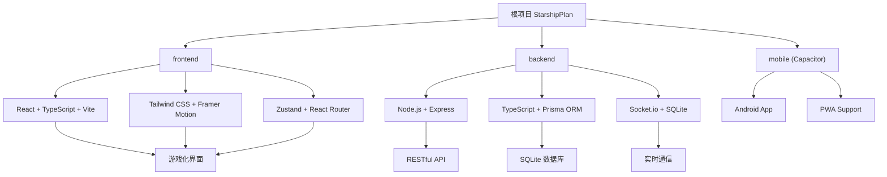

# 🚀 StarshipPlan（星舰计划）

> [根目录](../../CLAUDE.md) > **StarshipPlan**

## 项目愿景

StarshipPlan 是一个专为家庭内部使用的小学生习惯管理系统，采用太空冒险主题的游戏化设计。通过星币积分系统和等级晋升机制，让9岁男孩"葫芦"在完成日常任务的过程中获得成就感，将习惯养成变成一场有趣的星际冒险。

## 架构总览

### 系统架构图



### 技术栈

**前端技术**
- React 19 + TypeScript
- Vite 7 构建工具
- Tailwind CSS 4 样式框架
- Framer Motion 动画库
- Zustand 状态管理
- React Router 7 路由管理

**后端技术**
- Node.js + Express
- TypeScript
- Prisma ORM + SQLite
- Socket.io 实时通信
- JWT 身份验证
- Winston 日志管理

**移动端技术**
- Capacitor 跨平台框架
- PWA 渐进式Web应用
- Android 原生功能集成

## 模块索引

| 模块 | 路径 | 技术栈 | 状态 | 主要职责 |
|------|------|--------|------|----------|
| frontend | `/frontend` | React + TypeScript + Vite | 🟡 初始化 | 游戏化用户界面、习惯任务展示、积分系统 |
| backend | `/backend` | Node.js + Express + TypeScript | 🟡 初始化 | RESTful API、数据管理、实时通信 |
| mobile | `/mobile` | Capacitor + Android | 🔴 未创建 | 移动端打包和原生功能集成 |
| docs | `/docs` | Markdown | 🔴 未创建 | 项目文档和部署指南 |
| scripts | `/scripts` | Shell/Node.js | 🔴 未创建 | 自动化脚本和部署工具 |

## 运行与开发

### 环境要求
- Node.js 18+
- npm 9+
- Android Studio (移动端开发)

### 快速启动

**后端开发**
```bash
cd backend
npm install
npm run dev  # 开发模式启动 (端口 8000)
```

**前端开发**
```bash
cd frontend
npm install
npm run dev  # 开发模式启动 (端口 5173)
```

**移动端开发**
```bash
# 构建前端并同步到移动端
cd frontend && npm run build
npx cap sync android
npx cap open android  # 打开 Android Studio
```

### 构建与部署

**生产构建**
```bash
# 构建前端
npm run build

# 构建后端
npm run build:backend

# 启动生产服务器
npm start
```

## 测试策略

### 测试框架
- 前端：Vitest + React Testing Library
- 后端：Jest + Supertest
- E2E：Playwright

### 测试覆盖范围
- [ ] 单元测试：核心业务逻辑
- [ ] 集成测试：API 接口
- [ ] 端到端测试：关键用户流程
- [ ] 性能测试：移动端响应速度

### 质量工具
- ESLint：代码规范检查
- TypeScript：类型安全
- Prettier：代码格式化
- Husky：Git hooks 管理

## 编码规范

### 命名约定
- **文件命名**: kebab-case (如 `user-profile.tsx`)
- **组件命名**: PascalCase (如 `UserProfile`)
- **变量命名**: camelCase (如 `userName`)
- **常量命名**: UPPER_SNAKE_CASE (如 `API_BASE_URL`)

### 代码组织
- 每个组件一个文件
- 工具函数按功能模块分组
- 类型定义统一放在 `types/` 目录
- 常量配置统一放在 `config/` 目录

### Git 提交规范
```
feat: 新功能
fix: 修复 bug
docs: 文档更新
style: 代码格式调整
refactor: 代码重构
test: 测试相关
chore: 构建过程或辅助工具的变动
```

## AI 使用指引

### 开发助手角色
- **功能开发**: 协助实现游戏化界面和业务逻辑
- **代码审查**: 检查代码质量和规范性
- **问题诊断**: 帮助解决技术难题和 bug
- **文档生成**: 自动生成 API 文档和用户手册

### 关键上下文
- 项目目标用户：9岁小学生和家长
- 技术栈：现代 React + Node.js 全栈
- 部署环境：家庭本地网络
- 设计理念：简单易用，游戏化体验

### 优先级指导
1. **儿童体验优先**: 界面友好，操作简单
2. **家长管理便捷**: 配置简单，数据清晰
3. **系统稳定可靠**: 本地部署，数据安全
4. **性能响应快速**: 移动端体验流畅

## 变更记录 (Changelog)

**2025-12-16 19:12:06** - 初始化项目架构文档
- 创建根级 CLAUDE.md
- 识别 frontend 和 backend 两个主要模块
- 生成 Mermaid 架构图
- 制定开发规范和测试策略
- 项目处于基础架构阶段，前端后端已完成初始化

---

*让习惯养成变成一场有趣的太空冒险！🚀✨*