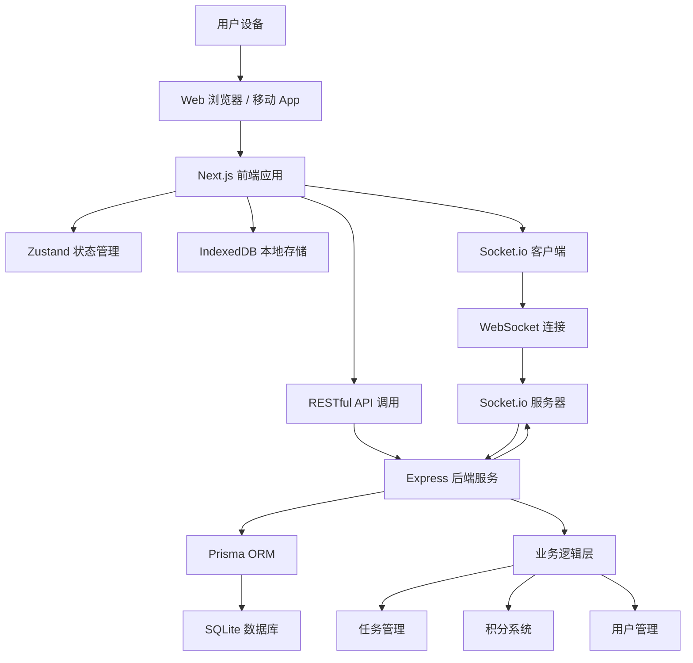

# StarshipPlan Fullstack Architecture Document
> 项目集成联调架构指南

## Introduction

This document outlines the complete fullstack architecture for StarshipPlan, including backend systems, frontend implementation, and their integration. It serves as the single source of truth for AI-driven development, ensuring consistency across the entire technology stack.

This unified approach combines what would traditionally be separate backend and frontend architecture documents, streamlining the development process for modern fullstack applications where these concerns are increasingly intertwined.

### Starter Template or Existing Project

**项目状态**: 已完成的前后端集成项目

StarshipPlan 是一个基于现有技术栈构建的全栈应用：
- **前端**: Next.js 16 + React 19 + TypeScript + Tailwind CSS 4
- **后端**: Node.js + Express + TypeScript + Prisma ORM + SQLite
- **实时通信**: WebSocket (Socket.io)
- **状态管理**: Zustand + IndexedDB
- **架构模式**: 棕地项目扩展（已从 Vite 迁移至 Next.js）

### Change Log

| Date | Version | Description | Author |
|------|---------|-------------|--------|
| 2025-12-17 | v1.0 | 初始全栈架构文档 - 项目集成联调版本 | BMad Orchestrator |

---

## High Level Architecture

### Technical Summary

StarshipPlan 采用现代化的全栈架构，通过 Next.js 16 的 App Router 实现服务端渲染和客户端组件的完美结合。系统使用 Express.js 作为后端 API 服务器，Prisma ORM 管理 SQLite 数据库，Socket.io 提供实时通信功能。前端采用 Tailwind CSS 4 配合 Radix UI 组件库，构建响应式的太空主题游戏化界面。

### Platform and Infrastructure Choice

**Platform:** 本地家庭网络部署 + Docker 容器化
**Key Services:** Next.js、Express、SQLite、Socket.io、Zustand、IndexedDB
**Deployment Host and Regions:** 家庭本地网络 (192.168.x.x)

### Repository Structure

**Structure:** Monorepo (前端和后端分离目录)
**Monorepo Tool:** 根目录统一管理，独立子项目
**Package Organization:**
- `/frontend` - Next.js 应用程序
- `/backend` - Express API 服务
- `/mobile` - Capacitor 移动端（待实现）
- `/scripts` - 自动化脚本

### High Level Architecture Diagram

### Architectural Patterns

- **Component-Based UI:** 可复用 React 组件 - 契约: 提高可维护性和一致性
- **Repository Pattern:** Prisma ORM 抽象数据访问 - 契约: 测试友好和数据迁移灵活性
- **Event-Driven Architecture:** Socket.io 实时事件系统 - 契约: 实时响应和松耦合
- **CQRS Pattern:** 命令查询职责分离 - 契约: 读写操作优化
- **Offline-First Architecture:** IndexedDB 本地缓存 + 冲突解决 - 契约: 离线功能支持
- **API Gateway Pattern:** Express 路由集中管理 - 契约: 统一认证和限流